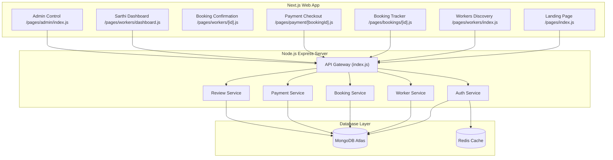

# Sahayog Sarthi Project Analysis Report

This report presents a thorough gap analysis of the **Sahayog Sarthi** on-demand worker booking platform by comparing the project codebase against the [Sahayog_Sarthi_SRS_Developer_Guide.pdf](file:///c:/Users/bibha/Desktop/sahayog-sarthi/Sahayog_Sarthi_SRS_Developer_Guide.pdf).

---

## 1. Executive Status Dashboard

The project consists of a **Node.js/Express.js backend** and a **Next.js (React) frontend**. 

### Overall Completion Summary
*   **Monorepo Setup:** ⚠️ **Partially Complete** (The `mobile/` React Native folder and `docs/` API documentation directory specified in Step 1 of the build guide are missing).
*   **Database Design:** ⚠️ **Partially Complete** (A serious bug was identified in `Payment.js` model).
*   **Backend REST APIs:** ⚠️ **Partially Complete** (Multiple endpoints are missing, and some routes are unregistered).
*   **Real-time Sockets & Notifications:** ✅ **Completed** (Socket.IO events, live locations, and Telegram integration are operational).
*   **Frontend Web Panels:** ⚠️ **Partially Complete** (Customer profile page is missing; several components fall back to mockup due to backend API gaps; query param spelling mismatch blocks review modal).

---

## 2. Core Bug & Schema Defect Log

Before detailing functional areas, here are the critical development bugs that currently block core workflows:

> [!CAUTION]
> ### 1. Payment Database Schema Defect
> * **File:** [Payment.js](file:///c:/Users/bibha/Desktop/sahayog-sarthi/backend/src/models/Payment.js)
> * **Issue:** The schema file does not define a Mongoose database model. Instead, it contains duplicated Express router configurations identical to `routes/payment.js`. This prevents payment transaction logs from saving to the MongoDB cluster.
> * **Impact:** Severe database schema mismatch.

> [!WARNING]
> ### 2. Payment Success Redirect Spelling Mismatch
> * **Files:** [payment/[bookingId].js](file:///c:/Users/bibha/Desktop/sahayog-sarthi/frontend/src/pages/payment/%5BbookingId%5D.js#L66) and [index.js](file:///c:/Users/bibha/Desktop/sahayog-sarthi/frontend/src/pages/index.js#L11-L25)
> * **Issue:** Upon sandbox checkout success, the payment page pushes:
>   `/?payment=success&bookingId=${bookingId}`
>   However, the landing page (`index.js`) expects:
>   `const { payment_success, booking_id } = router.query;`
>   and looks for `payment_success === 'true'`.
> * **Impact:** The Post-Service Rating & Feedback modal is **never triggered** after a successful payment transaction.

> [!WARNING]
> ### 3. Admin Overview Endpoint is Unregistered
> * **Files:** [workerController.js](file:///c:/Users/bibha/Desktop/sahayog-sarthi/backend/src/controllers/workerController.js#L134) and [worker.js (routes)](file:///c:/Users/bibha/Desktop/sahayog-sarthi/backend/src/routes/worker.js)
> * **Issue:** The controller defines `getAdminOverviewHub` to aggregate platform telemetry metrics (total users, active workers, commission earnings). However, this route is **never registered** in the worker routes file.
> * **Impact:** The Admin Dashboard (`admin/index.js`) fails to fetch live metrics and instantly falls back to mock sandbox display templates.

> [!WARNING]
> ### 4. Worker KYC Status Update Route Inconsistency
> * **Files:** [workerController.js](file:///c:/Users/bibha/Desktop/sahayog-sarthi/backend/src/controllers/workerController.js#L108-L131) and [worker.js (routes)](file:///c:/Users/bibha/Desktop/sahayog-sarthi/backend/src/routes/worker.js#L46)
> * **Issue:** The admin frontend calls `PUT /api/v1/workers/${workerId}/${decision}` (where `decision` is `approve` or `reject`). 
>   1. The backend routes file only binds `PUT /:id/approve`. There is **no route** mapped for rejection (`PUT /:id/reject`).
>   2. The controller extracts `const { id, action } = req.params;`. Since the route pattern is `/:id/approve`, `action` is undefined, causing it to fall back to 'approved'.
> * **Impact:** Rejections from the Admin Panel cause HTTP 404, and approvals fail to pass the parameter.

---

## 3. Detailed Checklist (Completed vs. Left)

Below is a breakdown of all system capabilities classified into **Completed**, **Partially Completed**, and **Left (Pending)**.

### 3.1 Authentication Module

| Status | Requirement ID | Requirement Details | Code Location | Gap / Notes |
| :---: | :--- | :--- | :--- | :--- |
| ✅ | **FR-01 (Backend)** | Customer register via Mobile + OTP | [authController.js](file:///c:/Users/bibha/Desktop/sahayog-sarthi/backend/src/controllers/authController.js#L20) | Fully functional. Stored in Redis. |
| ❌ | **FR-01 (Frontend)** | Customer Login OTP Input screens | Landing Page / Index | **Left.** The landing page assumes the user token is already in local storage. |
| ✅ | **FR-02 (Backend)** | Worker Registration & Multer file upload | [worker.js (routes)](file:///c:/Users/bibha/Desktop/sahayog-sarthi/backend/src/routes/worker.js#L15-L41) | Multer filters PDF, JPG, PNG under 5MB. |
| ❌ | **FR-02 (Frontend)** | Worker registration UI screens | Worker Dashboard | **Left.** No UI is available to register a new Sarthi. |
| ✅ | **FR-03** | JWT session management | [authMiddleware.js](file:///c:/Users/bibha/Desktop/sahayog-sarthi/backend/src/middlewares/authMiddleware.js) | JWT verifies and stores claims on `req.user`. |
| ❌ | **FR-04** | Admin credentials login / storage | `POST /auth/admin/login` | **Left.** No endpoints, models, or forms exist for Admin Authentication. |

---

### 3.2 Worker Discovery & Location Module

| Status | Requirement ID | Requirement Details | Code Location | Gap / Notes |
| :---: | :--- | :--- | :--- | :--- |
| ✅ | **FR-05 (Backend)** | Capture Customer GPS coordinates | [locationService.js](file:///c:/Users/bibha/Desktop/sahayog-sarthi/backend/src/services/locationService.js) | MongoDB 2dsphere indexing and `$geoNear` aggregation. |
| ⚠️ | **FR-05 (Frontend)** | Geolocation browser API integration | [workers/index.js](file:///c:/Users/bibha/Desktop/sahayog-sarthi/frontend/src/pages/workers/index.js#L15-L45) | **Bypassed.** Geolocation is commented out in code to lock the browser coordinate state to Lucknow for simulation. |
| ✅ | **FR-06** | Query workers within default 10km radius | [locationService.js](file:///c:/Users/bibha/Desktop/sahayog-sarthi/backend/src/services/locationService.js#L3) | Hardcoded default set to 10,000 meters. |
| ✅ | **FR-07** | Return worker name, distance, ETA, rating | [locationService.js](file:///c:/Users/bibha/Desktop/sahayog-sarthi/backend/src/services/locationService.js#L28-L41) | ETA calculated assuming 30 km/h average speed. |
| ⚠️ | **FR-08** | Filter results by distance, rating, price | [workers/index.js](file:///c:/Users/bibha/Desktop/sahayog-sarthi/frontend/src/pages/workers/index.js) | **Left.** The code only filters by service category. Distance/rating/price filters are missing. |

---

### 3.3 Booking Module

| Status | Requirement ID | Requirement Details | Code Location | Gap / Notes |
| :---: | :--- | :--- | :--- | :--- |
| ✅ | **FR-09** | Confirm booking payload dispatch | [bookingController.js](file:///c:/Users/bibha/Desktop/sahayog-sarthi/backend/src/controllers/bookingController.js#L19) | Customer payload verified through Express validator. |
| ⚠️ | **FR-10** | Push notifications to workers | [bookingController.js](file:///c:/Users/bibha/Desktop/sahayog-sarthi/backend/src/controllers/bookingController.js#L39-L55) | FCM (Firebase) is not integrated. Socket.IO and Telegram Bot are used instead. |
| ⚠️ | **FR-11** | Worker accept/reject within 60s timeout | [bookingController.js](file:///c:/Users/bibha/Desktop/sahayog-sarthi/backend/src/controllers/bookingController.js#L57-L81) | Countdown timeout works. Rejections are only in Telegram bot; **no Reject API exists on the backend REST route**. |
| ❌ | **FR-12** | Update booking status to 'In Progress' | Sarthi Dashboard | **Left.** Booking transitions from `accepted` directly to `completed`. The intermediate `in_progress` state trigger is missing. |
| ❌ | **FR-13** | Customer cancel booking before acceptance | `PUT /bookings/:id/cancel` | **Left.** No cancel API route or frontend button exists. |
| ❌ | **N/A (API)** | Fetch booking details | `GET /bookings/:id` | **Left.** Endpoint missing in [booking.js](file:///c:/Users/bibha/Desktop/sahayog-sarthi/backend/src/routes/booking.js). The tracker uses mock fallback on API 404. |
| ❌ | **N/A (API)** | Paginated booking history | `GET /bookings/history` | **Left.** Endpoint missing. |

---

### 3.4 Live Tracking & Communication Module

| Status | Requirement ID | Requirement Details | Code Location | Gap / Notes |
| :---: | :--- | :--- | :--- | :--- |
| ✅ | **FR-14 & 15** | Stream coordinates every 5s via Sockets | [workers/dashboard.js](file:///c:/Users/bibha/Desktop/sahayog-sarthi/frontend/src/pages/workers/dashboard.js#L84-L113) | Emits `location:update` to socket server. |
| ⚠️ | **FR-16** | Display worker's route on Map | [bookings/[id].js](file:///c:/Users/bibha/Desktop/sahayog-sarthi/frontend/src/pages/bookings/%5Bid%5D.js#L202) | Uses **React Leaflet** (OpenStreetMap) instead of Google Maps API. |
| ✅ | **FR-21** | In-app duplex chat room | [socketService.js](file:///c:/Users/bibha/Desktop/sahayog-sarthi/backend/src/services/socketService.js#L55-L80) | Implements Socket.IO `chat:message`. |
| ⚠️ | **FR-22** | Store messages and link to booking record | [Chat.js (model)](file:///c:/Users/bibha/Desktop/sahayog-sarthi/backend/src/models/Chat.js) | Messages are persisted. **Gap:** The REST route `/api/v1/bookings/chats/:id` to fetch historic messages is missing, so chat logs do not load on refresh. |

---

### 3.5 Payment & Review Modules

| Status | Requirement ID | Requirement Details | Code Location | Gap / Notes |
| :---: | :--- | :--- | :--- | :--- |
| ✅ | **FR-17** | Razorpay Order Creation API | [paymentController.js](file:///c:/Users/bibha/Desktop/sahayog-sarthi/backend/src/controllers/paymentController.js#L18) | Creates orders. Falls back to simulated mock order if environment variables are missing. |
| ✅ | **FR-18** | Trigger payment screen after completion | [bookings/[id].js](file:///c:/Users/bibha/Desktop/sahayog-sarthi/frontend/src/pages/bookings/%5Bid%5D.js#L114) | Sockets push payment redirect parameters to the client browser on completion. |
| ✅ | **FR-19** | Credit wallet after 15% platform split | [paymentController.js](file:///c:/Users/bibha/Desktop/sahayog-sarthi/backend/src/controllers/paymentController.js#L68-L88) | Deducts commission (`PLATFORM_COMMISSION`) and updates worker balance via `$inc`. |
| ❌ | **FR-20** | Worker payout withdrawal | `POST /payments/withdraw` | **Left.** Not implemented. Dashboard button is unfunctional. |
| ✅ | **FR-23** | Prompt customer to rate worker | [index.js (landing page)](file:///c:/Users/bibha/Desktop/sahayog-sarthi/frontend/src/pages/index.js#L110) | Interactive feedback modal triggers on query redirect. |
| ✅ | **FR-24** | Optional written review along rating | [review.js (controller)](file:///c:/Users/bibha/Desktop/sahayog-sarthi/backend/src/controllers/review.js) | Implemented via `Review` collection. |
| ✅ | **FR-25** | Recalculate average rating in real time | [review.js (controller)](file:///c:/Users/bibha/Desktop/sahayog-sarthi/backend/src/controllers/review.js#L38-L54) | Uses `$avg` database aggregation pipeline on review submission. |

---

### 3.6 Admin Module & Architecture

| Status | Requirement ID | Requirement Details | Code Location | Gap / Notes |
| :---: | :--- | :--- | :--- | :--- |
| ⚠️ | **FR-26** | Admin approve / reject worker KYC | [workerController.js](file:///c:/Users/bibha/Desktop/sahayog-sarthi/backend/src/controllers/workerController.js#L108) | **Buggy.** Missing routes/route param bindings (approve vs. reject parameters). |
| ⚠️ | **FR-27** | View live metrics dashboard | [admin/index.js](file:///c:/Users/bibha/Desktop/sahayog-sarthi/frontend/src/pages/admin/index.js) | **Mocked.** Live metrics are computed in controller but route is unregistered. |
| ❌ | **FR-28** | Block / unblock accounts | Admin Controller | **Left.** Missing. |
| ❌ | **FR-29** | Manage customer complaint tickets | Admin Controller | **Left.** Missing. |
| ❌ | **Arch** | React Native mobile application | Root Directory | **Left.** Folder `mobile/` is completely empty. |
| ❌ | **Arch** | API documentation folder | Root Directory | **Left.** Folder `docs/` is completely empty. |
| ❌ | **Page** | Customer profile and booking history page | `profile.js` | **Left.** File does not exist. |

---

## 4. Prioritized Action Plan

To transition this project to production-ready status, follow these remediation steps in order:

1.  **Fix Mongoose Payment Model:** Replace the duplicate express routing code inside [Payment.js](file:///c:/Users/bibha/Desktop/sahayog-sarthi/backend/src/models/Payment.js) with the Mongoose schema matching the database design.
2.  **Register Missing Backend Routes:**
    *   `GET /api/v1/bookings/:id` (Booking details retrieval)
    *   `GET /api/v1/bookings/chats/:id` (Chat history fetch endpoint linked to `getChatHistory` controller)
    *   `GET /api/v1/workers/admin/overview` (Overview analytics hub)
    *   `PUT /api/v1/workers/:id/:action` (Dynamic KYC approve/reject binding)
3.  **Remedial Redirect URL Parameter Mismatch:** Sync query names in [payment/[bookingId].js](file:///c:/Users/bibha/Desktop/sahayog-sarthi/frontend/src/pages/payment/%5BbookingId%5D.js) to match the parameter expectations (`payment_success` and `booking_id`) on the landing page [index.js](file:///c:/Users/bibha/Desktop/sahayog-sarthi/frontend/src/pages/index.js).
4.  **Implement Pending REST Endpoints:** Add logic for worker availability updates, customer cancellation, and booking reviews history.
5.  **Create Customer Profile Frontend Page:** Add `/pages/profile.js` to show active profiles and historical bookings list.
