# SYSTEM AUDIT REPORT
**Scope**: Worker & Admin Flow Authentication, Roles, and Lifecycle Protection  
**Date**: June 14, 2026  
**Status**: Audit Complete — *No code changes made, no commits/pushes performed.*

---

## PART 1 — WORKER AUTHENTICATION AUDIT REPORT

### Worker Authentication Journey Tracing

1. **Worker Registration Flow**:
   - The worker accesses `frontend/src/pages/auth/register-worker.js`.
   - They enter their personal and professional details (Name, 10-digit Mobile, Category, Experience, Hourly Rate, and Location coordinates).
   - The frontend sends a `POST /api/v1/auth/register/worker` request to the backend.
   - The backend `AuthController.registerWorker` delegates to `RegisterWorkerUseCase`.
   - A `Worker` document is created in the database with `kycStatus: 'pending'` and `isAvailable: false`.
   - The backend signs a JWT with payload `{ id: worker._id, role: 'worker' }`.
   - The token, worker data, and role are sent back and saved in the client's `localStorage` (`token`, `user`, and `role`).
   - The user is redirected to `/workers/dashboard`.
   - **Critical Gap**: Registration does not verify any OTP. Anyone can register a phone number as a Sarthi without proving they own it.

2. **Worker OTP Flow**:
   - **Missing**: There is no OTP generation or validation flow designed for workers. The `/auth/login` and `/auth/verify` routes are customer-centric.

3. **Existing Worker Login Flow (Re-login)**:
   - When a worker logs out and wants to log back in, they are redirected to `/auth/login`.
   - The worker enters their mobile number. The page requests `POST /api/v1/auth/send-otp`.
   - The worker enters the OTP. The page sends a request to `POST /api/v1/auth/verify-otp`.
   - The backend `VerifyOtpUseCase` queries the `UserRepository` (the `User` collection) to find the profile.
   - Since the worker was registered via `RegisterWorkerUseCase` and resides only in the `Worker` collection, the `userRepository.findByMobile` query returns `null`.
   - `VerifyOtpUseCase` returns `{ success: true, newCustomer: true }`.
   - The frontend prompts the worker to enter a name (treating them as a new customer).
   - Upon submitting a name, `VerifyOtpUseCase` creates a new document in the `users` collection, deletes the OTP, and signs a JWT with `role: 'customer'`.
   - The worker is logged in as a customer, redirected to the client landing page, and completely blocked from accessing `/workers/dashboard` by the `withAuth` HOC guard.
   - Their actual worker profile remains orphaned and inaccessible in the database.

4. **Worker Logout Flow**:
   - The worker clicks "Logout" on the dashboard.
   - `localStorage.clear()` is called, wiping the token, role, and profile cache.
   - The client is redirected back to `/auth/login`. This works correctly.

### Worker Authentication Summary
* **Is there a dedicated worker login page?**  
  No. Workers must use the customer login page, which lacks worker lookup.
* **How is an existing worker expected to log back in?**  
  They cannot. Logging in via the standard OTP flow registers them as a customer and locks them out.
* **Are workers using the customer login flow?**  
  Yes, which splits their identity and results in lockout.
* **Is worker authentication currently broken, incomplete, or functional?**  
  **Completely Broken** for existing worker log-ins, and **Incomplete** for registrations (bypasses OTP verification).

---

## PART 2 — WORKER APPROVAL FLOW AUDIT

### Worker State Machine (Current vs. Business Ideal)

```mermaid
state-diagram-v2
    [*] --> Pending : Register (isAvailable = false)
    Pending --> Approved : Admin Approve (isAvailable = true)
    Pending --> Rejected : Admin Reject (isAvailable = false)
    Approved --> Blocked : Admin Block (isAvailable = true/false)
    Blocked --> Approved : Admin Unblock (isAvailable = true/false)
    
    state "Invalid Transitions (Allowed by Current Backend)" as Invalid {
        Pending --> Online : Toggle Availability (isAvailable = true)
        Rejected --> Online : Toggle Availability (isAvailable = true)
    }
```

### Audit Findings

1. **Where approval status is stored**:
   - Stored in the `Worker` collection in the `kycStatus` field.
2. **Current status values**:
   - `'pending'`, `'approved'`, `'rejected'`. (Default: `'pending'`).
3. **How approval status changes**:
   - Admin hits `PUT /api/v1/workers/:id/approve` or `PUT /api/v1/workers/:id/reject`.
4. **Which API performs approval**:
   - `approveWorkerKYC` controller action ➔ `ApproveWorkerKycUseCase.js` (sets `kycStatus: 'approved'`, `isAvailable: true`).
   - `rejectWorkerKYC` controller action ➔ `RejectWorkerKycUseCase.js` (sets `kycStatus: 'rejected'`, `isAvailable: false`).
5. **Whether pending workers can access dashboard**:
   - Yes, they can access `/workers/dashboard` to upload KYC documents.
6. **Whether pending workers can receive bookings**:
   - **Direct booking**: **Yes.** `CreateBookingUseCase.js` does not load the worker profile or check its `kycStatus` or `isBlocked` fields. Customers can book pending or blocked workers directly by ID.
   - **Search results**: **No.** `MongoLocationAdapter.js` filters nearby worker queries on `kycStatus: 'approved'` and `isAvailable: true`.
7. **Whether approval checks are enforced in backend**:
   - **No.** `AcceptBookingUseCase.js` only checks `worker.isBlocked` but does not assert that `worker.kycStatus === 'approved'`. Hence, pending or rejected workers can accept bookings.
   - Also, `UpdateWorkerAvailabilityUseCase.js` allows pending and rejected workers to update their availability to `true`.

---

## PART 3 — ADMIN SYSTEM AUDIT

### Admin Integration Overview

1. **ADMIN LOGIN**:
   - **Status: MISSING.** There is no login form or endpoint for admin users. Admin accounts are not supported in the standard OTP verification workflow.
2. **ADMIN DASHBOARD**:
   - **Status: WORKING.** Reachable at `/admin` on the frontend if `localStorage.getItem('role') === 'admin'`. It successfully queries and displays metrics, pending workers, and live bookings.
3. **ADMIN FEATURES CLASSIFICATION**:

| Feature Name | Status | Frontend Status | Backend Status | Details / Violations |
| :--- | :--- | :--- | :--- | :--- |
| **Worker Approvals** | **PARTIALLY WORKING** | Working | Working | Approves KYC status, but backend endpoint lacks admin role checks. |
| **Worker Rejections** | **PARTIALLY WORKING** | Working | Working | Rejects KYC status, but backend endpoint lacks admin role checks. |
| **Pending Workers List** | **PARTIALLY WORKING** | Working | Working | Listed successfully, but backend endpoint lacks admin role checks. |
| **Bookings Overview** | **PARTIALLY WORKING** | Working | Working | Only shows "live" (active) bookings; cannot view past/history details. |
| **Payments Overview** | **MISSING** | Missing | Missing | No admin UI page or backend ledger query exists to review payments. |
| **Platform Metrics** | **PARTIALLY WORKING** | Working | Working | Correctly calculates values, but backend endpoint lacks admin role checks. |
| **User Management** | **MISSING** | Missing | Partially Working | Backend block/unblock APIs exist but have no UI list/control page on frontend. |

---

## PART 4 — ROLE PROTECTION AUDIT

### Security Verification & Route Analysis

1. **JWT Payload Roles**:
   - Structured as `{ id: String, role: 'customer' | 'worker' }`.
   - Verified via JWT token decoding.
2. **Middleware Role Checks**:
   - Backend only uses `protect` middleware (`authMiddleware.js`) which verifies token validity and maps `req.user = decoded`.
   - **Critical Vulnerability**: No backend middleware performs authorization checks (e.g. `checkRole(['admin'])`).
3. **Frontend Redirects**:
   - Handled by `withAuth` HOC. Works as expected on client-side.
4. **Protected Routes and Violations**:

| Endpoint | Intended Role | Current Middleware | Role Violations Identified |
| :--- | :--- | :--- | :--- |
| `GET /api/v1/workers/admin/overview` | Admin | `protect` | Any customer or worker can fetch full system metrics and booking logs. |
| `PUT /api/v1/workers/:id/approve` | Admin | `protect` | Any customer or worker can approve a worker's KYC. |
| `PUT /api/v1/workers/:id/reject` | Admin | `protect` | Any customer or worker can reject a worker's KYC. |
| `PUT /api/v1/workers/:id/block` | Admin | `protect` | Any customer or worker can block an active worker. |
| `PUT /api/v1/workers/:id/unblock` | Admin | `protect` | Any customer or worker can unblock a blocked worker. |
| `PUT /api/v1/bookings/:id/accept` | Assigned Worker | `protect` | Any user can accept a booking. No check verifies `req.user.id === booking.workerId`. |
| `PUT /api/v1/bookings/:id/start` | Assigned Worker | `protect` | Any user can start a booking. |
| `PUT /api/v1/bookings/:id/complete` | Assigned Worker | `protect` | Any user can complete a booking. |
| `PUT /api/v1/bookings/:id/cancel` | Assigned User | `protect` | Any user can cancel a booking. |
| `GET /api/v1/bookings/chats/:id` | Room Participants | `protect` | Any user can view private chat history of any booking. |

---

## PART 5 — MANUAL TEST PLAN

### Scenario A: New Customer Registration and Login
1. Open browser, clear storage, and navigate to `/auth/login`.
2. Input mobile `9876543210`. Click **Get OTP**.
3. Retrieve simulated OTP from backend console logs.
4. Input OTP. The UI should dynamically transition to the Name input form with the message: *"OTP Verified Successfully! Please tell us your name..."*.
5. Enter `Customer Test Name` and click **Complete Registration**.
6. Verify browser alerts success and redirects to `/` (Home). Inspect `localStorage` to confirm `role === 'customer'` and token is saved.

### Scenario B: New Worker Registration
1. Clear browser storage and navigate to `/auth/register-worker`.
2. Step 1: Input Name `Worker Test Name`, Mobile `8765432109`, Category `Electrician`, and Experience `3`. Click **Continue**.
3. Step 2: Input Hourly Rate `250`. Click **Capture Current Location** (or default to Lucknow). Click **Continue**.
4. Step 3: Verify the summary matches input fields. Click **Register Sarthi**.
5. Verify success alert, redirect to `/workers/dashboard`. Inspect `localStorage` to confirm `role === 'worker'` and token is saved.

### Scenario C: Admin Approves Worker (Using Token/Role Bypass)
1. Navigate to `/admin`.
2. Verify you are blocked and redirected to `/` since your client role is `'worker'` or `'customer'`.
3. Open Developer Tools Console. Manually execute:
   ```js
   localStorage.setItem('role', 'admin');
   localStorage.setItem('token', 'VALID_MOCK_ADMIN_TOKEN'); // Or bypass token checks in local sandbox
   ```
4. Reload `/admin`. Verify the dashboard renders metrics and displays `Worker Test Name` under **Pending Sarthi KYC Applications**.
5. Click **Approve Sarthi**.
6. Verify the worker disappears from the list, active worker count increases by 1, and database `kycStatus` is updated to `'approved'` for mobile `8765432109`.

### Scenario D: Approved Worker Login (Demonstrates Lockout Bug)
1. Clear browser storage and navigate to `/auth/login`.
2. Enter the approved worker's mobile `8765432109`. Click **Get OTP**.
3. Retrieve simulated OTP from backend console logs.
4. Input OTP and click **Verify & Login**.
5. **Observed Bug (Lockout)**: The UI transitions to the Name input registration page (treating the worker as a new customer) instead of logging them in.
6. Entering a name and submitting logs them in with `role: 'customer'`, and they cannot access `/workers/dashboard`.

### Scenario E: Pending Worker Login (Demonstrates Lockout Bug)
1. Repeat steps in **Scenario D** using a pending worker's mobile number.
2. Verify that they are also redirected to the customer name registration flow, locked out, and a duplicate `User` profile is generated in the `users` collection.

---

## PART 6 — COMPLETE SYSTEM AUDIT DELIVERABLES

### 1. Current Architecture
* The backend is written in Clean Architecture, separated into modular folders (`auth`, `worker`, `booking`, `payment`, `review`, `chat`).
* Endpoints utilize Mongoose schemas directly or via repository ports.
* Frontend is built in Next.js, with authentication status saved locally in browser `localStorage` and verified via a client-side High-Order Component `withAuth`.

### 2. Worker Login Status
* **Status**: **Severely Broken.** Workers have no dedicated page to log in, and the shared OTP verify use case is unaware of the Worker database entity. Logging in results in profile duplication and customer-role lockouts.

### 3. Worker Approval Status
* **Status**: **Partially Enforced.** KYC approvals alter worker DB status correctly. However, validation guards are missing on the backend booking creation, acceptance, and availability toggle flows, letting unapproved workers perform operations.

### 4. Admin UI Status
* **Status**: **Partially Functional.** The control dashboard renders correctly, but admin login is completely missing, and there are no UI management tabs for payments ledger or active worker block lists.

### 5. Admin Backend Status
* **Status**: **Insecure / Open.** While the underlying use cases compute metrics and update states correctly, the routes lack role protection authorization checks, allowing any authenticated customer to approve profiles, reject documents, or view platform revenue details.

### 6. Missing Functionality
* **Admin Login/Authentication flow**: No frontend screen or backend endpoint exists for Admin authentication.
* **Worker Login flow**: No worker-aware authentication lookup exists on `/api/v1/auth/verify-otp`.
* **OTP Verification on Worker Registration**: Worker registration does not send/verify an OTP.
* **Admin Payments & Commission Ledger**: Missing views/endpoints to review payment transaction lists.
* **Worker Block List UI**: Admin UI cannot list or manage blocked workers.

### 7. Broken Functionality
* **Existing Worker Login**: OTP login flow forces workers into customer onboarding, locking them out of their dashboards.
* **Assigned Worker Booking Validation**: Workers can accept bookings not assigned to them; anyone can complete or cancel any booking due to missing ID validation.

### 8. Security Concerns
* **Vulnerability 1 (Privilege Escalation)**: Admin endpoints (`/admin/overview`, `/:id/approve`, `/:id/block`, etc.) are protected only by token signature check. Any user with a valid client token can hit them.
* **Vulnerability 2 (Identity Theft/Spoofing)**: Worker registration creates accounts without verifying the mobile number, allowing registration of arbitrary phone numbers.
* **Vulnerability 3 (Data Leakage)**: Private chat histories and booking logs are open to any authenticated user via ID parameterized endpoints.

### 9. Recommended Fixes

1. **Unify Authentication in `VerifyOtpUseCase`**:
   - Update `VerifyOtpUseCase.execute` to search both `UserRepository` and `WorkerRepository`.
   - If a mobile number is found in the `Worker` collection first, verify OTP, generate a token with `{ role: 'worker', id: worker.id }`, and return worker metadata.
   - If found in the `User` collection, verify OTP, generate token with `{ role: 'customer' }`.
   - If in neither, return `newCustomer: true` to trigger registration.

2. **Add Backend Role Authorization Middleware**:
   - Implement a `restrictTo(...allowedRoles)` middleware.
   - Example: `router.get('/admin/overview', protect, restrictTo('admin'), getAdminOverview);`.
   - Implement checks inside `AcceptBookingUseCase`, `StartBookingUseCase`, etc. to verify `req.user.id === booking.workerId` or `req.user.role === 'admin'`.

3. **Verify OTP on Worker Onboarding**:
   - Add a step to send and verify OTP on `/auth/register-worker` before writing the profile to the database.

4. **Enforce Worker KYC Status in Workflows**:
   - Prevent booking creation (`CreateBookingUseCase`) if the target worker's KYC is not approved or if they are blocked.
   - Assert `worker.kycStatus === 'approved'` in `AcceptBookingUseCase` and `UpdateWorkerAvailabilityUseCase`.

### 10. Recommended Implementation Order

```mermaid
gantt
    title Sahayog Sarthi Phase 3.7 Fix Roadmap
    dateFormat  X
    axisFormat %d
    section Auth Unification
    Unify OTP Verification in backend (Workers + Customers lookup) : active, auth_1, 0, 3
    Add Dedicated Worker login options on frontend : auth_2, after auth_1, 2
    section Role & Authorization
    Implement restrictTo role middleware on backend : sec_1, 3, 5
    Apply restrictTo('admin') to all Admin routes : sec_2, after sec_1, 2
    Apply ownership checks (req.user.id === workerId) on Bookings/Chats : sec_3, after sec_2, 3
    section Lifecycle Verification
    Add KYC approved guard on Booking creation and acceptance : life_1, 5, 8
    Prevent unapproved workers from going online : life_2, after life_1, 2
    Verify OTP on Worker Registration : life_3, after life_2, 2
```


